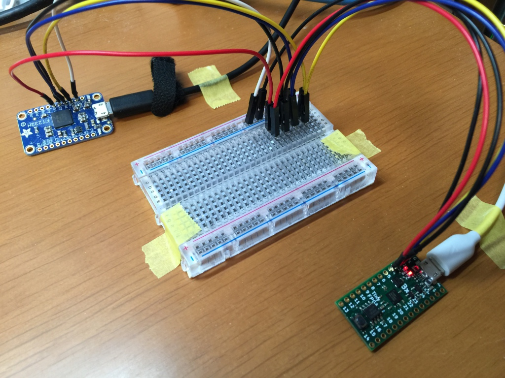
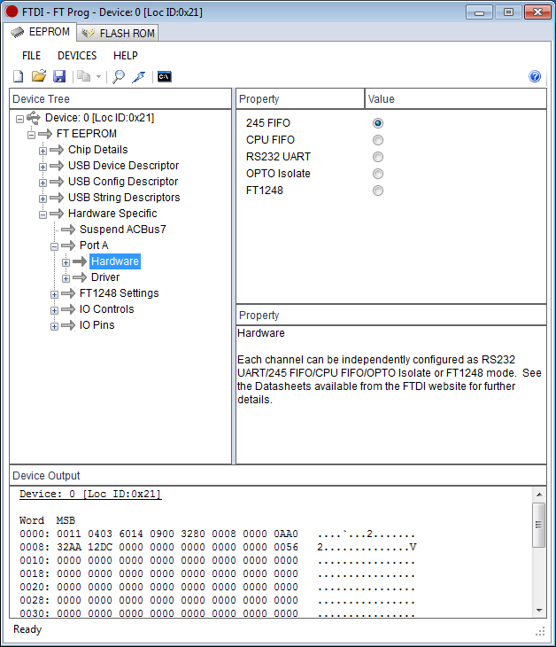

# Playing with JTAG, my PWM module on TinyFPGA-BX, and also Python scripting

- Learning how to use JTAG functionality of SpinalHDL.

- Also written a small Python code with PyFtdi for FTDI FT232H breakout.



## Preparation

1. Follow [this site](https://tinyfpga.com/bx/guide.html) and install tinyprog.

2. Also follow [this site](https://github.com/SpinalHDL/SpinalHDL) and install required software SpinalHDL.

3. Install Python3 and [PyFtdi](https://pypi.org/project/pyftdi/).

4. You need an FT232H or FT2232H breakout.
   I chose [Adafruit FT232H Breakout](https://www.adafruit.com/product/2264).
   You should **carefully disable UART mode** to configure JTAG TDO pin (D2) as input.
   ("245 FIFO" mode is my recommendation.  Please find the following screen capture.)
   Regarding EEPROM programming on the breakout by FTDI FT_PROG, [this page](https://learn.adafruit.com/adafruit-ft232h-breakout/more-info) is also helpful.



## Build

First, connect your TinyFPGA to a USB port.

```bash
$ make upload
```

Done.

## Pin Assignments

**FPGA side**: Please find this [PCF file](tinyfpga_bx.pcf).

**FT232H side**:

- ADBUS0 (D0): JTAG TCK (output from FT232H)
- ADBUS1 (D1): JTAG TDI (output from FT232H)
- ADBUS2 (D2): JTAG TDO (**input to** FT232H)
- ADBUS3 (D3): JTAG TMS (output from FT232H)

## Running Python Script

```bash
$ python3 scripts/jtag.py
```

## Logic cells utilization

```
Info: Device utilisation:
Info: 	         ICESTORM_LC:   141/ 7680     1%
Info: 	        ICESTORM_RAM:     0/   32     0%
Info: 	               SB_IO:     7/  256     2%
Info: 	               SB_GB:     4/    8    50%
Info: 	        ICESTORM_PLL:     0/    2     0%
Info: 	         SB_WARMBOOT:     0/    1     0%
```

## Timing analysis

```bash
$ icetime -tmd lp8k jtagpwm_tinyfpga_bx.asc 
Total number of logic levels: 4
Total path delay: 9.60 ns (104.17 MHz)
```

## Blog in Japanese

- [Deployed JTAG functionality of SpinalHDL on TinyFPGA BX and controlled it by Python](https://flogics.com/wp/ja/2020/04/control-fpga-jtag-by-python/)
